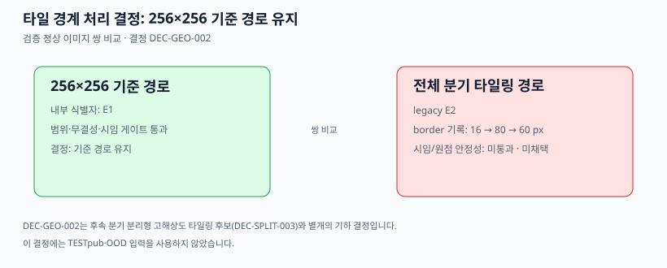

# FineDefect AD

**EfficientAD-S Small을 70,000 step 학습하고, 검증 전용 원시 이상 점수·타일링 기하 검증·임계값 보정을 증거 기반으로 연결한 미세 결함 이상 탐지 프로젝트입니다.**





## 프로젝트 개요

제조 이미지의 정상 데이터에서 이상 점수 맵을 생성하는 EfficientAD-S Small 파이프라인입니다. 학습 결과와 검증 산출물을 SHA-256으로 연결하고, 검증 데이터만으로 기하 처리와 원시 임계값을 결정하도록 구성했습니다.

공개 SVG는 수치와 처리 흐름을 요약한 도식입니다. 데이터셋에서 생성한 실제 미리보기 이미지는 재배포 권한을 확인하지 않아 로컬 증거로만 보관합니다.

## 핵심 구현

- **학습**: EfficientAD-S Small 70,000 step 학습, 체크포인트·학습 이력·실행 식별자를 해시로 결속
- **검증 맵 수집**: E1 기본 경로와 E2 고해상도 타일링 경로에서 검증용 원시 맵 19개를 저장
- **기하 선택**: 사전 고정된 검증 규칙으로 E1/E2의 경계·시임 응답을 비교하고 선택 결과를 동결
- **보정**: 선택된 E1 맵 1,245,184 pixel의 평균과 모집단 표준편차로 원시 임계값 산출
- **추적성**: 산출물명·해시·런 ID·GPU lease 수명주기를 확인하며 잘못된 입력을 거부

## 시스템 아키텍처

입력 데이터 → EfficientAD-S Small 학습 → 체크포인트/실행 식별자 고정 → E1·E2 검증 맵 수집 → 기하 검증 및 선택 고정 → 검증 전용 원시 임계값 보정 순서로 동작합니다. 배포 추론과 최종 판정은 이 범위에 포함하지 않습니다.

## 주요 설계 결정

- **E1 선택**: E2는 map border 80 px를 시도한 뒤 두 번째 경험적 border 60 px로 재측정했지만 `REVISION_UNSTABLE_RETAIN_E1` 상태였습니다. 시임 검증이 불안정하여, 계층적 비가중 검증 규칙이 E1을 선택했습니다.
- **검증/시험 분리**: 임계값 계산에는 검증 정상 이미지의 원시 점수만 사용합니다. TESTpub·TESTpriv·OOD 입력은 보정 경로에서 차단됩니다.
- **판정 보류**: 검증 가능한 외부 비교기 프로토콜이 없으므로 비교기, F1, 이미지·픽셀 판정, TESTpub 감사는 의도적으로 차단됩니다.

## 검증 결과

| 항목 | 확인된 결과 |
| --- | --- |
| 학습 모델 | EfficientAD-S Small, 70,000 step |
| 최종 학습 손실 / 처리량 | 2.16434598 / 7.4513 step/s |
| 체크포인트 SHA-256 | `9e7a5f567a83f42d…a4154801` |
| E1 검증 | `READY`, 원시 맵 19개 |
| E2 검증 | `READY`, 전체 해상도 원시 맵 19개, 241.286 s |
| TESTpub 원시 맵 추출 | `READY`, 114개(정상 24 / 불량 90), 20.523 s |
| 선택된 측정 | E1 |
| 원시 임계값 | 0.20741951395977676 (`mean + 3 × population std`) |

수치의 근거, 입력 결속, 한계는 [G002 평가 상세](docs/G002_EVALUATION.md)에서 확인할 수 있습니다.

## 빠른 실행

```bash
python3 -m pytest -q

export ARTIFACT_ROOT=/path/to/artifacts
export DATASET_ROOT=/path/to/dataset
PYTHONPATH=src python3 -m fine_defect_ad.g002_eval_runtime --help
```

실제 평가에는 학습 체크포인트, teacher 가중치, Imagenette, GPU lease 디렉터리가 필요합니다. 전체 재현 명령은 [평가 문서](docs/G002_EVALUATION.md#재현)를 따릅니다.

## 저장소 구조

```text
src/fine_defect_ad/  학습, 검증, 기하 검증, 보정 런타임
tests/               단위·통합 회귀 테스트
docs/                공개 포트폴리오 문서와 도식
```

## 상세 문서

- [G002 평가와 한계](docs/G002_EVALUATION.md)
