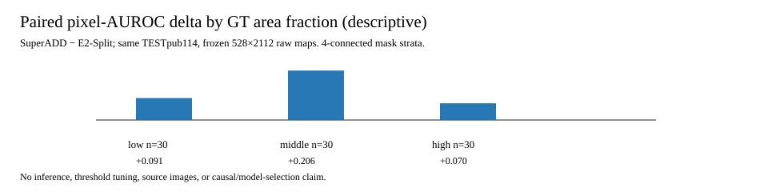

# FineDefect AD

**고해상도 금속 표면 결함을 놓치지 않기 위한 추론 구조를 설계하고, 두 이상 탐지 파이프라인을 같은 공개 시험 데이터와 평가기로 재현·비교한 프로젝트입니다.**


## 프로젝트 개요

MVTec AD 2 Sheet-Metal 이미지는 가로로 긴 고해상도 영상입니다. 전체 이미지를 256×256으로 축소하면 작은 결함의 위치 정보가 약해질 수 있습니다. 이 프로젝트는 다음 두 경로를 각각 구현하고, **같은 공개 시험 이미지 114장**, **같은 528×2112 이상 맵**, **같은 공식 평가기**로 결과를 비교합니다.

- **E2-Split 고해상도 추론**: EfficientAD로 원본을 256×256 타일 처리한 국소 이상 맵과 전체 장면의 전역 이상 맵을 결합합니다.
- **SuperADD / DINOv3 비교 경로**: 정상 이미지 특징을 메모리 뱅크로 구성하고 입력 특징과의 거리로 이상 영역을 찾습니다.

여기서 **256×256 기준선**은 전체 이미지를 한 장의 256×256 입력으로 축소한 EfficientAD 경로입니다. **E2-Split**은 같은 EfficientAD 체크포인트를 다시 학습하지 않고 고해상도 분할 추론을 적용한 경로입니다.

## 핵심 성과

| 구현·검증 항목 | 결과 | 확인한 역량 |
| --- | --- | --- |
| EfficientAD 고해상도 추론 | Image AU-ROC `0.595370 → 0.734722`, AU-PRO@0.05 `0.020582 → 0.132685` | 타일 분할, 국소·전역 맵 결합, 경계 가중 결합 |
| TensorRT FP32 + Triton 서빙 | 대표 이미지 E2E `2.4610 → 2.1040초` (`-14.5%`) | 모델 변환, binary HTTP, 배치 추론, 수치 보존 검증 |
| SuperADD / DINOv3 재현 | Image AU-ROC `0.839352`, AU-PRO@0.05 `0.431407` | 사전학습 특징 추출, 정상 메모리 뱅크, 독립 평가 파이프라인 |
| 오류 특성 분석 | 동일 114장에 대한 익명 이상 맵·GT mask 쌍 분석 | 결함 면적·형상별 오차 패턴의 데이터 기반 기술 |

TensorRT 전후 TESTpub 지표는 Image AU-ROC `0.734722 → 0.733333`, AU-PRO@0.05 `0.132685 → 0.132769`로 근접하게 유지됐습니다. 지연 수치는 EfficientAD 대표 이미지 측정이며, SuperADD의 114장 분포 측정과 직접 속도 비교하지 않습니다.

## 핵심 구현

1. **고해상도 분할 추론**
   256×256 타일의 국소 교사–학생 잔차를 Hann 가중치로 이어 붙이고, 전체 장면을 본 오토인코더–학생 잔차와 동결된 분위수로 결합합니다.
2. **재현 가능한 평가 체계**
   체크포인트, 입력 목록, 원시 이상 맵, 평가 결과를 SHA-256으로 연결합니다. TESTpub은 학습·보정·임계값 선택에 사용하지 않습니다.
3. **TensorRT/Triton 실행 경로**
   FP32 TensorRT plan, Triton HTTP binary transport, 타일 배치 4, 최종 맵 parity와 TESTpub backend A/B를 검증했습니다.
4. **독립 모델 비교와 오류 분석**
   두 파이프라인의 동일 이미지 결과를 익명 ID로 연결해 픽셀 순위 성능과 결함 형상별 차이를 분석했습니다. 원본 제조 이미지는 공개하지 않습니다.

## 시스템 아키텍처


입력 이미지 → 타일 분할 → TensorRT FP32/Triton 추론 → 타일 결합 → 원시 이상 맵 → 평가 순서입니다. SuperADD는 동일 평가 규약을 사용하는 별도 Python 추론 경로이며, 현재 TensorRT/Triton 실행 경로에는 포함하지 않았습니다.

## 평가 결과 읽는 법

- **Image AU-ROC**: 이미지 한 장이 정상인지 이상인지 순위를 얼마나 잘 구분하는지 나타냅니다.
- **AU-PRO@0.05**: 허용 오탐률 5% 구간에서 결함 영역을 얼마나 잘 찾는지 나타냅니다.
- 모든 수치는 MVTec AD 2 Sheet-Metal 공개 시험 114장의 고정 원시 점수로 계산했습니다.
- 이 결과는 재현 가능한 비교와 시스템 구현 증거이며 SOTA, 생산 배포 성능, 최종 모델 선정 또는 다른 데이터에 대한 일반화를 뜻하지 않습니다.



상세 분석에는 실제 익명 이상 맵과 정답 마스크 패널도 포함합니다. [결함 형상별 분석 방법과 결과](docs/PAIRED_RAWMAP_ANALYSIS.md)

## 빠른 실행

```bash
python3 -m pytest -q

export ARTIFACT_ROOT=/path/to/artifacts
export DATASET_ROOT=/path/to/dataset
PYTHONPATH=src python3 -m fine_defect_ad.highres_split infer --help
PYTHONPATH=src python3 -m fine_defect_ad.tensorrt_promotion --help
```

실제 추론에는 별도로 허가받은 데이터셋, 모델 가중치, 학습 체크포인트와 GPU 환경이 필요합니다. 대용량 원시 맵과 모델 파일은 별도 아티팩트 저장소에 둡니다. 필요한 입력과 산출물은 [재현성 문서](docs/REPRODUCIBILITY.md)에 정리했습니다.

## 저장소 구조

```text
src/fine_defect_ad/  학습·고해상도 추론·평가·TensorRT/Triton 실행 코드
tests/               파이프라인 계약과 증거 무결성 회귀 테스트
docs/                아키텍처·평가·재현·한계와 시각자료
evidence/            공개 가능한 결정·지표·해시 결속 증거
```

## 상세 문서

| 알고 싶은 내용 | 문서 |
| --- | --- |
| 두 파이프라인의 구성과 데이터 흐름 | [아키텍처](docs/ARCHITECTURE.md) |
| 지표 정의, 비교 조건, 결과 해석 | [평가 방법](docs/EVALUATION.md) |
| 환경 준비, 검증 명령, 산출물 확인 | [재현 방법](docs/REPRODUCIBILITY.md) |
| 검증하지 않은 범위와 해석 주의점 | [한계](docs/LIMITATIONS.md) |
| EfficientAD 학습·고해상도 추론 세부 | [Sheet-Metal 평가](docs/SHEET_METAL_EVALUATION.md) |
| TensorRT/Triton 변환·성능·수치 보존 | [배포 백엔드 평가](docs/DEPLOYMENT_EVALUATION.md) |
| 동일 이미지의 오류 특성 분석 | [Paired raw-map 분석](docs/PAIRED_RAWMAP_ANALYSIS.md) |
| 외부 코드·모델의 출처와 라이선스 | [라이선스](LICENSES.md) |
