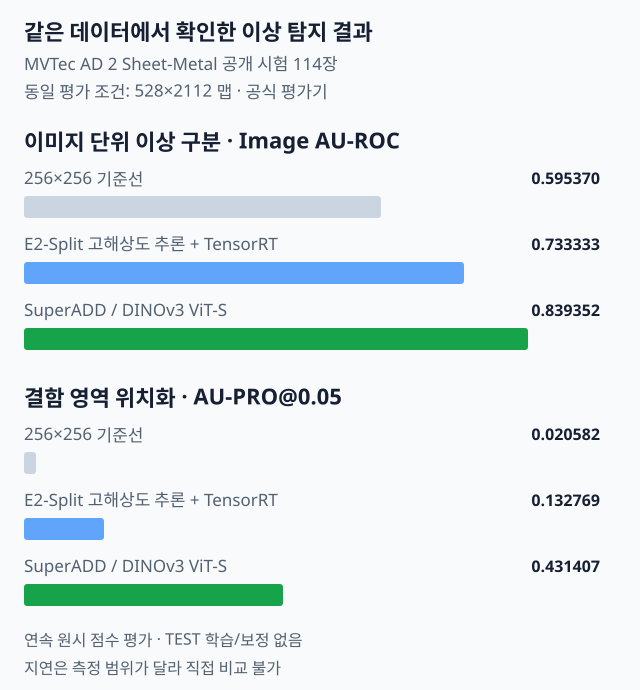

# FineDefect AD

**제조 sheet-metal 이상 탐지의 두 독립 파이프라인—EfficientAD E2-Split+TensorRT/Triton과 SuperADD/DINOv3—를 동일 TESTpub 114, 익명 ID, 528×2112 raw-map geometry, 공식 evaluator, SHA-256 결속으로 비교하는 재현 포트폴리오입니다.** 운영 배포·SOTA·최종 모델 선택·일반화 우열·임계값 기반 판정은 주장하지 않습니다.



## 독립 파이프라인과 비교 경계

정상 이미지로만 bank/보정 경계를 고정하고, TESTpub은 한 번의 raw-map 평가에만 사용했습니다. 아래 수치는 재학습·TEST tuning·threshold 선택 없이 기록된 연속 점수의 Image AU-ROC/AU-PRO@0.05입니다. 지연은 서로 다른 evidence scope(단일 E2-Split 대표 이미지와 SuperADD 114장 inference 분포)라 직접 비교하거나 속도 우위로 해석하지 않습니다.

| 경로 | Image AU-ROC | AU-PRO@0.05 | 지연 | 해석 |
| --- | ---: | ---: | ---: | --- |
| 256×256 기준선 | 0.595370 | 0.020582 | — | 동일 EfficientAD-S checkpoint의 기준 |
| EfficientAD E2-Split + TensorRT/Triton | 0.733333 | 0.132769 | 대표 단일 고해상도 이미지 2.1040 s | 독립 구현/검증 경로 |
| SuperADD ViT-S / DINOv3 direct/posthoc | **0.83935185** | **0.43140701** | **114장 inference: mean 1.1414 s, p50 1.0242 s/image** | 독립 비교 파이프라인 |

## 구현·비교 체계

1. **EfficientAD E2-Split + TensorRT/Triton** — 고해상도 타일, TensorRT FP32 plan, Triton HTTP transport의 구현과 수치 보존을 기록합니다.
2. **SuperADD/DINOv3** — pinned ViT-S, one-pass normal bank, FP32 및 posthoc 528×2112 evaluation geometry의 독립 비교 파이프라인입니다.
3. **재현 비교 경계** — 두 결과는 동일 TESTpub 114, 익명화 ID, 528×2112 raw-map, 공식 evaluator, 해시 결속을 사용합니다. metric 차이는 이 고정 비교의 기록이며 SOTA·운영 최종선정·일반화 우열을 뜻하지 않습니다.
4. **배포 범위** — SuperADD의 Triton 연결은 현재 비교 연구 범위 밖입니다. DINO export, feature/final-map parity, bank serialization은 별도 배포 검증이 필요합니다.


## 공개 시각화 경계

시각화는 원시 anomaly-map의 집계 수치와 익명화된 raw-map-only 흐름만 사용합니다. 원본 제조 이미지, 로컬 경로, 식별 가능한 preview는 공개 자산에 포함하지 않습니다.

## 빠른 실행

```bash
python3 -m pytest -q

export ARTIFACT_ROOT=/path/to/artifacts
export DATASET_ROOT=/path/to/dataset
PYTHONPATH=src python3 -m fine_defect_ad.highres_split infer --help
PYTHONPATH=src python3 -m fine_defect_ad.tensorrt_promotion --help
```

실제 실행에는 학습 체크포인트, 교사 가중치, TensorRT plan, 고정된 분할 동결 산출물, GPU lease 디렉터리가 필요합니다. 공개 CLI는 원시 맵과 검증 증거를 기록하며, 이 README는 운영 서비스 배포 절차를 제공하지 않습니다.

## 저장소 구조

```text
src/fine_defect_ad/  학습, 고해상도 추론, TensorRT/Triton 후보 검증
tests/               단위·통합 회귀 테스트
docs/                공개 포트폴리오 문서와 도식
evidence/            공개 가능한 평가 기준선·비교·입력 해시
```

## 상세 문서

- [배포 후보와 backend A/B 평가](docs/DEPLOYMENT_EVALUATION.md)
- [고해상도 추론 평가와 한계](docs/SHEET_METAL_EVALUATION.md)
- [기준선 평가](evidence/g002/baseline_evaluation.json)
- [고해상도 경로 비교](evidence/g002/evaluation_comparison.json)
- [라이선스와 출처](LICENSES.md)
