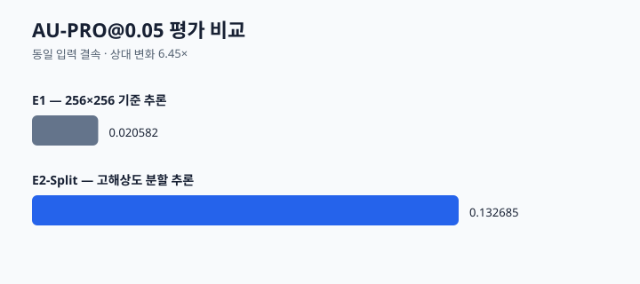
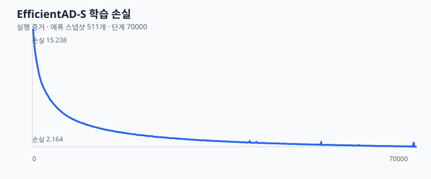

# FineDefect AD

**고해상도 제조 이미지 이상 탐지에서, 동일 EfficientAD-S 체크포인트의 분할 추론을 TensorRT FP32 plan과 Triton으로 실행하고 정확도 보존·지연·추적성을 함께 검증한 포트폴리오입니다.**


## 프로젝트 개요

정상 제조 이미지로 학습한 EfficientAD-S Small에서 이상 점수 맵을 생성합니다. 주된 추론 경로는 원본 해상도를 256×256 타일로 나누는 **E2-Split 고해상도 분할 추론**입니다. 이 경로를 고정된 TensorRT FP32 plan으로 실행하고 Triton HTTP binary transport로 호출했습니다.

공개 결과는 두 질문을 분리합니다.

1. **추론 경로**: 같은 체크포인트에서 고해상도 분할 추론이 256×256 기준선과 어떻게 다른가
2. **백엔드 교체**: 같은 고해상도 분할 경로에서 TorchScript B4와 TensorRT FP32/Triton이 정확도와 지연을 어떻게 바꾸는가

이 저장소는 재현 가능한 포트폴리오와 후보 백엔드 검증을 위한 것입니다. 운영 임계값, 실시간 SLA, production promotion을 주장하지 않습니다.

## 핵심 구현

- **고해상도 분할 추론**: 원본 해상도를 256×256 타일로 나누고, 국소 교사–학생 특징 잔차와 표준 256×256 전역 오토인코더–학생 잔차를 결합합니다. 타일은 Hann 가중치로 stitch합니다.
- **TensorRT FP32 + Triton**: 고정 입력 TensorRT FP32 plan을 Triton에서 제공하고 HTTP binary transport로 호출합니다. 평가·검증에 사용한 Triton image는 digest로 고정했습니다.
- **검증 경계**: 분할 경로의 분위수는 검증 정상 이미지 19장으로만 동결합니다. TESTpub은 학습·보정·튜닝에 사용하지 않았습니다.
- **추적성**: 체크포인트, plan, 입력 식별자, 원시 맵, 실행 산출물을 SHA-256으로 결속합니다.

## 시스템 아키텍처


고해상도 입력을 고정 기하의 타일로 나누고, TensorRT FP32 plan을 Triton으로 호출한 뒤 stitch·맵 결합합니다. 결과는 원시 이상 맵이며 검증 또는 TESTpub 평가로만 이어집니다. 임계값 기반 운영 판정은 이 저장소의 범위가 아닙니다.

## 검증 결과

### 백엔드 A/B — 고해상도 분할 추론

| 항목 | TorchScript B4 기준 | TensorRT FP32 + Triton | 해석 |
| --- | ---: | ---: | --- |
| 대표 고해상도 E2E 지연 | 2.4610 s/image | 2.1040 s/image | 대표 단일 이미지 측정에서 **14.5% 감소** |
| TESTpub Image AU-ROC | 0.734722 | 0.733333 | -0.001389 |
| TESTpub AU-PRO@0.05 | 0.132685 | 0.132769 | +0.000084 |
| TESTpub 입력 | 114 images | 동일 114 images | 같은 체크포인트, backend A/B, 재보정·튜닝 없음 |

대표 E2E 지연은 단일 고해상도 이미지의 고정된 경로를 측정한 값입니다. 114-image TESTpub의 총 persistence/evaluator 시간과 다른 측정이므로 서로 나누거나 실시간 처리량으로 해석하지 않습니다.

### 수치 보존과 실행 결속

| 항목 | 결과 | 해석 |
| --- | --- | --- |
| 최종 맵 parity | 검증 이미지 3장 모두 이미지 판정 동일 | 최종 맵 계약 확인 |
| 불확실성 대역 밖 flip | 0 | 대역 경계 근처의 픽셀 차이는 별도 기록 |
| GPU reserved peak | 465,567,744 bytes | 서버 준비 후 후보 실행에서 관측한 값 |
| Triton image | `nvcr.io/nvidia/tritonserver:26.06-py3@sha256:a40838bb4587d2aceb46b1e7fd144afb24c9016c219dd3eba31716e4e28dbfc7` | 컨테이너 실행 환경 결속 |

정확도 차이는 local TESTpub evaluator의 결과입니다. TensorRT backend A/B는 모델 선택, calibration, threshold 변경 없이 한 번의 고정된 평가로 수행했습니다.

### 고해상도 추론 경로의 기준 비교

동일 체크포인트의 256×256 기준 추론과 비교한 고해상도 분할 추론 결과도 유지합니다. 이는 **추론 경로** 비교이며 재학습 효과가 아닙니다.



| 항목 | 256×256 기준 추론 | 고해상도 분할 추론 |
| --- | ---: | ---: |
| Image AU-ROC | 0.595370 | 0.734722 |
| AU-PRO@0.05 | 0.020582 | 0.132685 |

절대 AU-PRO@0.05는 낮습니다. 이 결과를 모델 성능의 강점, 배포 승격, 또는 운영 품질 보장으로 해석하지 않습니다.



## 설계 판단과 한계

- 고해상도 분할 추론의 분위수는 검증 정상 이미지 19장으로만 계산·동결했습니다.
- TensorRT FP32/Triton 검증은 정확도 보존과 후보 백엔드의 실행 가능성을 보여 줍니다. production readiness, 부하·장시간 안정성, 다중 GPU 확장성은 검증하지 않았습니다.
- 검증 이미지 3장 parity와 TESTpub 114장 backend A/B는 서로 다른 목적으로 기록했습니다. 전자는 최종 맵의 수치 계약, 후자는 고정된 평가 지표 보존을 확인합니다.
- `READY` 또는 parity 통과는 운영 배포 승인이나 실제 공정에서의 불량 검출 보증을 뜻하지 않습니다.

## 빠른 실행

```bash
python3 -m pytest -q

export ARTIFACT_ROOT=/path/to/artifacts
export DATASET_ROOT=/path/to/dataset
PYTHONPATH=src python3 -m fine_defect_ad.highres_split infer --help
PYTHONPATH=src python3 -m fine_defect_ad.tensorrt_promotion --help
```

실제 실행에는 학습 체크포인트, 교사 가중치, TensorRT plan, 고정된 분할 동결 산출물, GPU lease 디렉터리가 필요합니다. 공개 CLI는 원시 맵과 검증 증거를 기록하며, 이 README는 운영 서비스 배포 절차를 제공하지 않습니다.

## 저장소 구조

```text
src/fine_defect_ad/  학습, 고해상도 추론, TensorRT/Triton 후보 검증
tests/               단위·통합 회귀 테스트
docs/                공개 포트폴리오 문서와 도식
evidence/            공개 가능한 평가 기준선·비교·입력 해시
```

## 상세 문서

- [배포 후보와 backend A/B 평가](docs/DEPLOYMENT_EVALUATION.md)
- [고해상도 추론 평가와 한계](docs/SHEET_METAL_EVALUATION.md)
- [기준선 평가](evidence/g002/baseline_evaluation.json)
- [고해상도 경로 비교](evidence/g002/evaluation_comparison.json)
- [라이선스와 출처](LICENSES.md)
