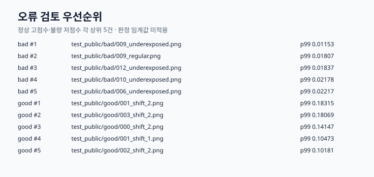

# FineDefect AD

**EfficientAD-S Small을 70,000 step 학습하고, 검증 전용 원시 이상 점수·256×256 기준 경로·분기 분리형 고해상도 타일링 후보를 증거 기반으로 연결한 미세 결함 이상 탐지 프로젝트입니다.**


## 프로젝트 개요

제조 이미지의 정상 데이터에서 이상 점수 맵을 생성하는 EfficientAD-S Small 파이프라인입니다. 학습 결과와 검증 산출물을 SHA-256으로 연결하고, 검증 데이터만으로 기하 처리와 원시 임계값을 결정하도록 구성했습니다.

공개 SVG는 수치와 처리 흐름을 요약한 도식입니다. 데이터셋에서 생성한 실제 미리보기 이미지는 재배포 권한을 확인하지 않아 로컬 증거로만 보관합니다.

## 핵심 구현

- **학습**: EfficientAD-S Small 70,000 step 학습, 체크포인트·학습 이력·실행 식별자를 해시로 결속
- **기하 결정**: 256×256 기준 경로(내부 식별자 `E1`)와 전체 분기 타일링 경로(legacy `E2`)의 경계·시임 응답을 비교하고 기준 경로를 동결
- **후속 평가 후보**: 별도 결정 `DEC-SPLIT-003`에서 고해상도 타일 기반 국소 교사–학생 특징 잔차(ST)와 전역 오토인코더–학생 잔차(STAE)를 결합한 맵을 검증 정상 이미지 19장으로 동결
- **보정**: 동결된 256×256 기준 경로 맵 1,245,184 pixel의 평균과 모집단 표준편차로 원시 임계값 산출
- **추적성**: 산출물명·해시·런 ID·GPU lease 수명주기를 확인하며 잘못된 입력을 거부

## 시스템 아키텍처

기준 경로는 입력 데이터 → EfficientAD-S Small 학습 → 체크포인트/실행 식별자 고정 → 기하 검증 → 256×256 기준 경로 동결 → 검증 전용 원시 임계값 보정 순서로 동작합니다. 별도 후속 평가 후보는 동일 체크포인트에서 분기 분리형 고해상도 타일링 맵을 검증 정상 이미지로만 동결한 뒤 TESTpub을 1회 평가합니다. 이 평가는 기존 기하 결정·보정·학습을 바꾸지 않습니다. 배포 추론과 최종 판정은 이 범위에 포함하지 않습니다.

## 주요 설계 결정

- **256×256 기준 경로 유지**: `DEC-GEO-002`에서 전체 분기 타일링 경로(legacy `E2`)는 시임·원점 안정성 게이트를 통과하지 못했습니다. 따라서 계층적 비가중 검증 규칙이 256×256 기준 경로(내부 식별자 `E1`)를 유지했습니다. 이 결정은 성능 비교가 아니라 경계 처리 안정성 결정입니다.
- **분기 분리형 고해상도 타일링 후보**: 이후 별도 `DEC-SPLIT-003`에서 원본 해상도의 256×256 타일을 128 px stride와 Hann 가중치로 결합한 **국소 교사–학생 특징 잔차(ST)** 맵과, 표준 256×256 입력에서 1회 계산한 **전역 오토인코더–학생 잔차(STAE)** 맵을 결합했습니다. 이 후보의 `READY`는 입력·기하·분위수 동결 통과를 뜻하며, 기존 `DEC-GEO-002` 선택을 승격하거나 모델을 재학습했다는 뜻이 아닙니다.
- **검증/시험 분리**: 임계값 계산에는 검증 정상 이미지의 원시 점수만 사용합니다. TESTpub·TESTpriv·OOD 입력은 보정 경로에서 차단됩니다.

## 검증 결과

| 항목 | 결과 | 해석 |
| --- | --- | --- |
| 학습 모델 | EfficientAD-S Small, 70,000 step | 동일 체크포인트로 평가 |
| 최종 학습 손실 / 처리량 | 2.16434598 / 7.4513 step/s | 최종 학습 이력 |
| 체크포인트 SHA-256 | `9e7a5f567a83f42d…a4154801` | 실행 식별자와 결속 |
| 256×256 기준 경로 검증 | `READY`, 원시 맵 19개 | 내부 식별자 `E1`; 기준 보정 입력 |
| 분기 분리형 고해상도 타일링 후보 검증 | `READY`, 원시 맵 19개 | `DEC-SPLIT-003`; 국소 교사–학생 특징 잔차(ST) + 전역 오토인코더–학생 잔차(STAE) 결합 |
| 256×256 기준선 TESTpub AU-PRO@0.05 | 0.02058176590668011 | 최초 평가 기준선 |
| 분기 분리형 고해상도 타일링 후보 TESTpub AU-PRO@0.05 | 0.13268484492898858 | 동일 체크포인트의 사후 파이프라인 평가, 약 6.45배 |
| 과거 기하 결정 | 256×256 기준 경로 유지 | `DEC-GEO-002`; 후속 분할 후보와 별개 |
| 원시 임계값 | 0.20741951395977676 | 256×256 기준 경로 검증 정상 점수의 `mean + 3σ` |




수치의 근거, 입력 결속, 한계는 [G002 평가 상세](docs/G002_EVALUATION.md)에서 확인할 수 있습니다.

최초 평가와 파이프라인 변경 비교는 [기준선](evidence/g002/baseline_evaluation.json), [평가 비교](evidence/g002/evaluation_comparison.json), [검토 우선 사례](evidence/g002/error_cases.csv)에 공개합니다. 원본 데이터와 대용량 맵은 라이선스·용량 때문에 포함하지 않고 해시만 제공합니다.

## 빠른 실행

```bash
python3 -m pytest -q

export ARTIFACT_ROOT=/path/to/artifacts
export DATASET_ROOT=/path/to/dataset
PYTHONPATH=src python3 -m fine_defect_ad.g002_eval_runtime --help
PYTHONPATH=src python3 -m fine_defect_ad.evaluation_history --help
```

실제 평가에는 학습 체크포인트, teacher 가중치, Imagenette, GPU lease 디렉터리가 필요합니다. 전체 재현 명령은 [평가 문서](docs/G002_EVALUATION.md#재현)를 따릅니다.

## 저장소 구조

```text
src/fine_defect_ad/  학습, 검증, 기하 검증, 보정 런타임
tests/               단위·통합 회귀 테스트
docs/                공개 포트폴리오 문서와 도식
evidence/            공개 가능한 평가 기준선·비교·입력 해시
```

## 상세 문서

- [G002 평가와 한계](docs/G002_EVALUATION.md)
- [라이선스와 출처](LICENSES.md)
