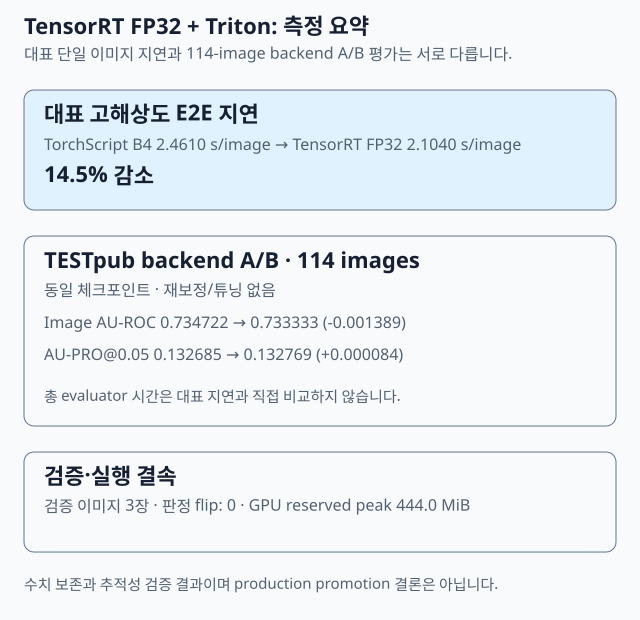
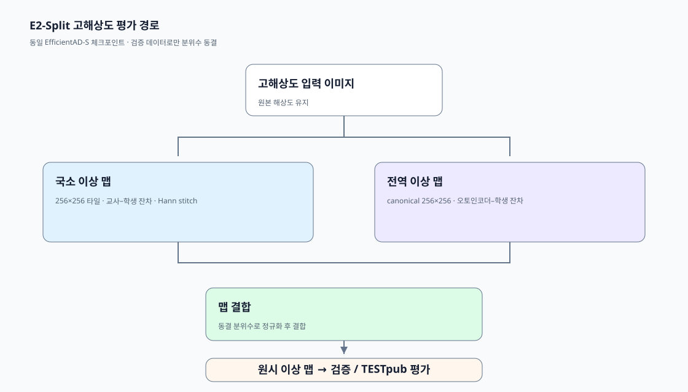

# TensorRT FP32 · Triton 후보 백엔드 평가

이 문서는 **EfficientAD E2-Split의 모델 계산을 TensorRT FP32와 Triton으로 옮겼을 때 지연이 줄고 이상 맵 성능이 유지되는지** 검증한 방법과 결과를 설명합니다.

- **Backend A/B**: 같은 모델·입력·후처리를 유지하고 실행 엔진만 바꾼 비교입니다.
- **E2E 지연**: 타일 생성부터 모델 호출, 맵 결합까지 한 이미지 처리에 걸린 시간입니다.
- **Parity**: 변환 전후 최종 이상 맵의 수치·판정 일치 여부입니다.

## 결론

고해상도 분할 추론을 **TensorRT FP32 plan + Triton**으로 실행하는 후보 백엔드를 검증했다. 같은 EfficientAD-S Small 체크포인트와 고정된 분할 동결 산출물을 사용한 backend A/B에서, 대표 단일 이미지 E2E 지연은 TorchScript B4의 **2.4610 s/image**에서 TensorRT FP32/Triton의 **2.1040 s/image**로 **14.5% 감소**했다.

고정된 TESTpub 114장 평가에서는 Image AU-ROC가 `0.734722 → 0.733333` (`-0.001389`), AU-PRO@0.05가 `0.132685 → 0.132769` (`+0.000084`)였습니다. 이 문서는 후보 백엔드의 수치 보존과 추적성을 기록합니다. 생산 배포 승인, 실시간 처리량, 운영 SLA의 근거는 아닙니다.

## 범위와 고정 조건

| 구분 | 고정 조건 |
| --- | --- |
| 모델 | 동일 EfficientAD-S Small 체크포인트, SHA-256 `9e7a5f567a83f42dacf80318df3d3bd33b7a7c922b1035bb529ecf59a4154801` |
| 추론 | 고해상도 분할 추론, 256×256 타일, Hann stitch, 동결 분위수 |
| 기준 backend | TorchScript B4 |
| 후보 backend | TensorRT FP32 plan, Triton HTTP binary transport |
| 평가 입력 | TESTpub 114장(정상 24 / 불량 90) |
| A/B 규칙 | 같은 체크포인트·입력·분할 동결 산출물, 재보정·튜닝·모델 선택 없음 |
| 컨테이너 | `nvcr.io/nvidia/tritonserver:26.06-py3@sha256:a40838bb4587d2aceb46b1e7fd144afb24c9016c219dd3eba31716e4e28dbfc7` |

## 실행 경로

1. 고해상도 입력을 고정 기하의 256×256 타일로 분할한다.
2. 각 타일의 고정 입력을 TensorRT FP32 plan으로 실행하고 Triton HTTP binary transport에서 수신한다.
3. 타일별 국소 맵을 Hann 가중치로 stitch하고, 전역 맵과 동결 분위수로 결합한다.
4. 원시 이상 맵을 저장한 뒤 검증 또는 TESTpub evaluator에 전달한다.

원시 맵은 운영 판정이 아니다. TESTpub 평가에서도 threshold를 새로 맞추거나 선택하지 않았다.

## 지연 측정: 대표 이미지와 전체 평가를 분리

| 측정 | TorchScript B4 | TensorRT FP32 + Triton | 변화 |
| --- | ---: | ---: | ---: |
| 대표 고해상도 E2E | 2.4610 s/image | 2.1040 s/image | -14.5% |
| TESTpub 평가·저장 | 별도 기록 | 114장, 총 283.6581 s | 대표 지연과 비교 불가 |

대표 E2E 값은 고정된 한 고해상도 이미지에서 tile 분할, backend 호출, stitch·결합까지의 한 경로를 측정한 값이다. 114-image 총 시간은 원시 맵 persistence와 evaluator 실행을 포함하는 별도 측정이다. 따라서 아래 주장은 하지 않는다.

- `2.1040 s/image`가 전체 TESTpub 평균 또는 p95 지연이라는 주장
- 결과가 실시간 처리량, 동시성, 장시간 안정성, 운영 SLA를 뜻한다는 주장
- 두 시간 값을 직접 비율로 계산해 backend 성능을 일반화하는 주장

## 정확도 보존: 고정된 TESTpub backend A/B

| 지표 | TorchScript B4 | TensorRT FP32 + Triton | 절대 변화 |
| --- | ---: | ---: | ---: |
| Image AU-ROC | 0.734722 | 0.733333 | -0.001389 |
| AU-PRO@0.05 | 0.132685 | 0.132769 | +0.000084 |

Image AU-ROC는 이미지별 최종 원시 맵 최대값으로 이상 이미지를 순위화한다. AU-PRO@0.05는 픽셀 위치화 지표다. 두 값은 local evaluator 결과이며 AD2 server 또는 leaderboard 결과가 아니다.

A/B 실행은 TESTpub을 tuning 데이터로 사용하지 않았다. 결과는 모델 성능 개선이나 챔피언 모델 선택이 아니라, 고정된 추론 경로에서 backend를 바꿨을 때의 보존 기록이다.

## 최종 맵 parity와 자원 관측

| 항목 | 결과 | 의미 |
| --- | --- | --- |
| 검증 final-map parity | 3 images `PARITY_PASS` | 이미지 단위 verdict 동일 |
| 불확실성 대역 밖 flip | 0 | 대역 밖에서 최종 판정 계약 위반 없음 |
| GPU reserved peak | 465,567,744 bytes | 서버 준비 후 후보 실행에서 기록 |
| 고정 image digest | `a40838bb4587d2aceb46b1e7fd144afb24c9016c219dd3eba31716e4e28dbfc7` | Triton 실행 환경 식별 |

`불확실성 대역 밖 flip = 0`은 세 검증 이미지에서의 final-map parity 계약 결과다. 모든 픽셀이 동일했거나 모든 입력·공정 조건에 대해 동일하다는 뜻은 아니다.

## 증거 경계와 다음 검증 항목

현재 증거는 다음을 지원한다.

- 고정된 컨테이너 digest, plan, 체크포인트, 입력과 원시 맵의 결속
- 대표 고해상도 경로에서의 지연 변화 기록
- 고정 TESTpub에서 재보정·튜닝 없는 backend A/B 지표 기록
- 세 검증 이미지의 final-map verdict parity

다음 항목은 이 결과만으로 결론낼 수 없으며 별도 검증이 필요하다.

- 실제 생산 이미지 분포에서의 검출 성능과 운영 임계값
- 동시 요청, 재시작, 장시간 실행, 장애 복구
- GPU·드라이버·Triton 버전이 달라졌을 때의 재현성
- latency percentile, queue time, capacity planning

## 관련 문서

- [README](../README.md): 프로젝트 요약과 공개 결과
- [고해상도 추론 평가와 한계](SHEET_METAL_EVALUATION.md): 분할 추론 경로와 256×256 기준선 비교
- [고해상도 경로 비교 JSON](../evidence/g002/evaluation_comparison.json): 동일 체크포인트의 기존 경로 비교
