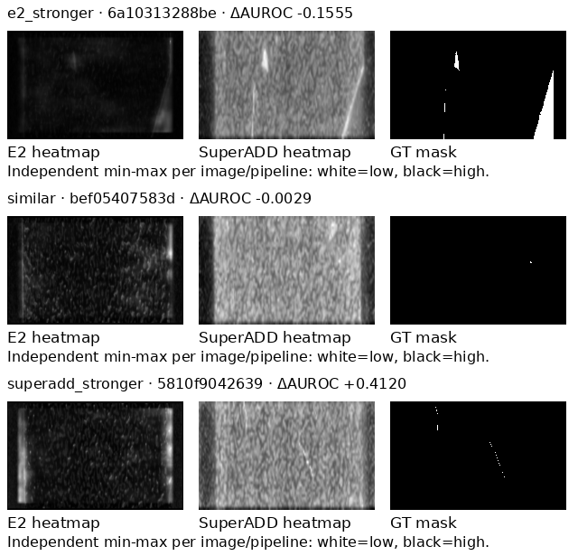

# Frozen paired raw-map analysis

The paired analysis replays only the same TESTpub114 E2-Split and posthoc SuperADD/DINOv3 raw maps with their ground-truth masks at 528×2112. It verifies map, source, and mask hashes before computing per-image tie-aware pixel AUROC, mask geometry descriptors, within-model score-rank deltas, descriptive quantile strata, and Spearman associations. It performs no inference, retraining, threshold selection, or test tuning.

Its findings are measured associations, not architecture-causality or model-selection claims. Raw score magnitudes are not compared across pipelines; image scores are rank-normalized within each pipeline. Visual panels contain anonymized raw-map + GT-mask representations—never source imagery or local paths.

Mask compactness uses the 4-connected digital perimeter: `4πA/P²`, where `P` counts exposed north/south/east/west pixel edges. Dataset-relative low/middle/high terciles include their exact cutpoints, counts, and mean paired pixel-AUROC deltas in the canonical evidence; they are descriptive only.

## 대표 raw-map 패널

아래 패널은 동일한 익명 ID의 E2 heatmap, SuperADD heatmap, GT mask를 나란히 둔다. 원본 이미지는 포함하지 않는다. heatmap은 **각 이미지·파이프라인 내부** min–max 정규화(흰색=낮음, 검정=높음)라 절대 점수 크기를 비교하지 않으며, 표시한 paired pixel-AUROC delta는 SuperADD−E2이다.

